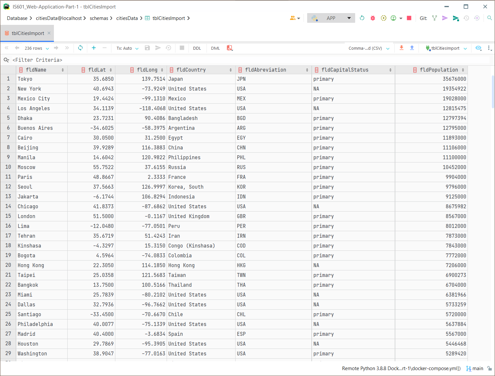
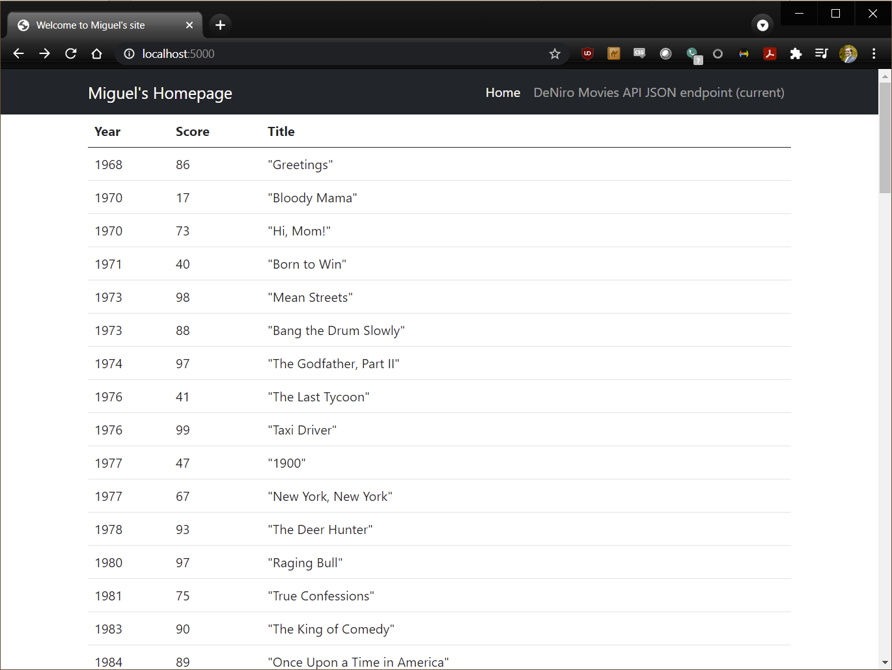

# IS601_Web-Application-Part-3

## Project Description
This project is a homework assignment to teach how to get Pycharm setup with Docker, Flash, MySQL, Bootstrap HTML templates, and HTML forms to create new records, update records, and a small form that has no fields other than a submit button to delete records

## Postman Screenshot

## PyCharm Database Screenshot

## Bootstrap Template Screenshot
