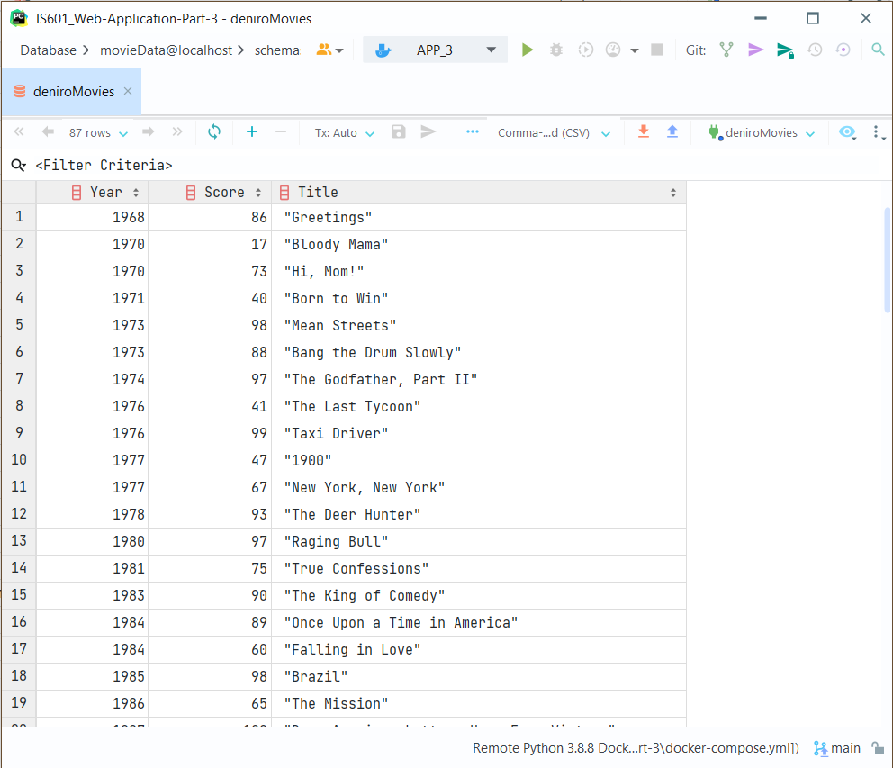

# IS601_Web-Application-Part-2

## Project Description
This project is a homework assignment to taeach how to get Pycharm setup with Docker, Flash, MySQL, and Bootstrap HTML templates

## Postman Screenshot

## PyCharm Database Screenshot

## Bootstrap Template Screenshot
